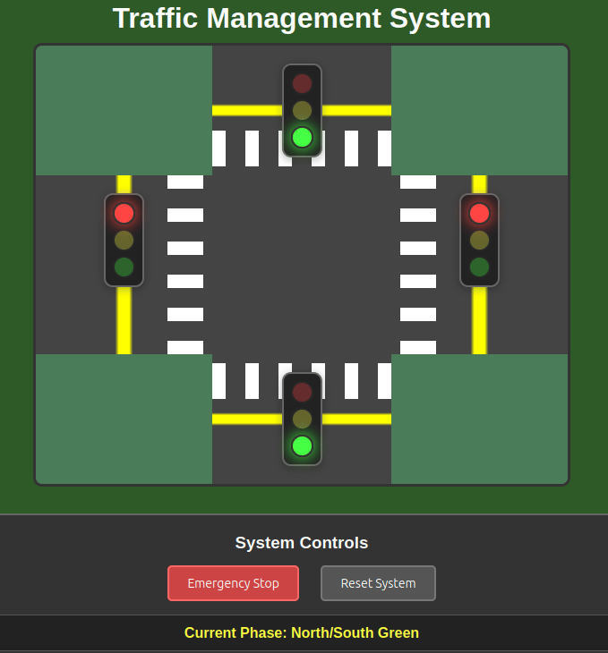

# Traffic Management System - Debugging Instructions



**Your Mission**: Fix a broken traffic control system for a 4-way intersection. The system should have working traffic lights, crosswalk markings, emergency controls, and automatic light cycling - but almost nothing is working correctly.

**Approach**: Work systematically through each problem. Use your browser's Developer Tools (F12) and follow the guided debugging steps below.

## Phase 1: Visual Layout Issues (~1.5 hours)

The intersection doesn't look anything like a real intersection. Before we can make it functional, we need to fix the visual layout.

### Problem 1: Intersection Structure is Broken
**What you should see**: A 4-way intersection with roads extending from a center point  
**What you actually see**: Roads are stacked vertically in a weird layout

*Investigation needed*: Look at the CSS for `.intersection` - what property makes an element into a grid container? Also check the grid area assignments for each road direction.

### Problem 2: Missing HTML Classes
**What you should see**: All roads should look similar and be positioned correctly  
**What you actually see**: Some roads are missing or positioned wrong

*Investigation needed*: Check the HTML structure. Do all road elements have the same classes? Are any missing the base `road` class?

### Problem 3: Traffic Light Container Issues  
**What you should see**: All traffic lights should look the same  
**What you actually see**: Some traffic lights look different from others

*Investigation needed*: Check if all traffic light containers have the same class in the HTML.

### Problem 4: Roads Don't Look Like Roads
**What you should see**: Roads with traffic lights positioned properly in the center  
**What you actually see**: Traffic lights are positioned strangely within each road section

*Investigation needed*: Check the CSS for `.road` - what display property makes an element a flex container? How should content be arranged and aligned?

### Problem 5: Crosswalks are Invisible or Scattered
**What you should see**: White striped crosswalk markings forming proper pedestrian crossing areas  
**What you actually see**: No crosswalk markings visible, or white rectangles scattered randomly

*Investigation needed*: The crosswalk elements exist in the HTML, but their flexbox layout is broken. Check both horizontal and vertical crosswalk CSS.

### Problem 6: Traffic Lights Don't Look Like Traffic Lights
**What you should see**: Red, yellow, and green circles that look like actual traffic lights  
**What you actually see**: Gray circles with no colors or effects

*Investigation needed*: Multiple issues here - missing opacity/transition effects, missing color classes, and missing active state styling. Check the CSS hints carefully.

## Phase 2: JavaScript Debugging Journey (~1.5 hours)

Now for the real challenge! The intersection looks great, but nothing actually works. We're going to take a **guided debugging journey** together, where each fix reveals the next layer of the problem. This is exactly how real debugging works!

**Important**: Follow these steps in order. Each step teaches you how to find and fix the next problem.

### Step 1: Understanding Script Timing

Let's start by testing what happens when we load the page.

**First, open your browser's Developer Tools:**
- Press F12 (or right-click → Inspect → Console tab)
- Refresh the page
- Look at the Console tab

**What you should see**: Red error messages appearing immediately

**Let's understand what's happening:**
1. Look at your HTML file - where is the `<script src="script.js"></script>` tag located?
2. The browser reads HTML from top to bottom
3. When it hits the script tag in the `<head>`, it immediately runs all the JavaScript
4. But the HTML elements (like buttons and traffic lights) haven't been created yet!
5. So when JavaScript tries to find `document.getElementById('emergency-stop')`, it returns `null`

**The fix:**
Move the `<script>` tag from the `<head>` to just before the closing `</body>` tag. This way, the script runs AFTER all the HTML elements exist.

**Test the fix:**
1. Save and refresh the page
2. Check the console - the startup errors should be gone
3. Now click the "Emergency Stop" button
4. Watch the console carefully...

**What you should notice**: New error appears when you click the button! This leads us to our next problem...

### Step 2: Tracking Down Element Selection Issues

Great! The button click now triggers the function, but it immediately crashes. Let's debug this step by step.

**Understanding the error:**
Look at the console error - it should say something like `Cannot read property 'querySelectorAll' of null`. This is telling us:
1. The `emergencyStop()` function is running (good!)
2. But somewhere inside it, we're calling `.querySelectorAll()` on something that is `null`
3. This means `getElementById()` didn't find an element

**Let's investigate:**
1. Open `script.js` and find the lines where we get references to traffic lights
2. Look at the IDs being used: `north-light`, `south-light`, etc.
3. Now check your HTML file - what are the actual IDs of the traffic light elements?

**What you should discover**: The IDs don't match! JavaScript is looking for one thing, HTML has another.

**The fix:**
Change the JavaScript variable assignments to use the correct IDs from your HTML.

**Test the fix:**
1. Save and refresh
2. Click "Emergency Stop" again
3. Watch the console - the error should be gone
4. But look at the traffic lights themselves...

**What you should notice**: No error, but the lights don't actually change color! This leads us to the next issue...

### Step 3: Understanding CSS Class Manipulation

The function runs without errors now, but the lights don't change. Let's trace through what's happening.

**Understanding CSS class logic:**
1. Open your browser's Elements tab (next to Console)
2. Click "Emergency Stop" and immediately look at one of the traffic light elements
3. Watch the classes being added and removed in real-time

**What to investigate:**
1. Are the CSS classes being added to the light elements?
2. Do those class names match the CSS rules you wrote in Phase 1?
3. Check: does JavaScript add `.red` or does CSS expect `.light.red`?

**Debugging with console.log:**
Add this line in the `setLight()` function to see what's happening:
```javascript
console.log('Setting light to:', color, 'on element:', lightElement);
```

**The fix:**
Make sure the CSS class names in JavaScript match exactly what you defined in your CSS rules.

**Test the fix:**
1. Save and refresh
2. Click "Emergency Stop"
3. The lights should turn red now!
4. Click "Reset System"

**What you should notice**: Lights change colors! But when you watch the automatic cycling, something seems off...

### Step 4: Fixing Timer Management Issues

The lights work manually, but the automatic cycling has problems. Let's investigate.

**Understanding the issue:**
1. Click "Reset System" and watch the automatic cycling
2. Click "Emergency Stop" then "Reset System" multiple times quickly
3. Open the console and watch for any patterns

**What you might notice:**
- Cycling speeds up over time
- Multiple timers running simultaneously
- Phases might skip or happen too fast

**Investigation:**
1. Look at the `resetSystem()` function
2. Look at the `emergencyStop()` function  
3. Are timers being cleared properly before starting new ones?

**Understanding timer cleanup:**
```javascript
// When you create a timer:
trafficInterval = setTimeout(nextPhase, 4000);

// You must clear it before creating a new one:
if (trafficInterval) {
    clearTimeout(trafficInterval);
    trafficInterval = null;
}
```

**The fix:**
Ensure timers are properly cleared in both `emergencyStop()` and `resetSystem()` functions.

**Test the fix:**
1. Try clicking Emergency/Reset multiple times
2. The cycling should maintain consistent timing
3. But you might notice the emergency stop doesn't blink...

### Step 5: Making Emergency Animation Work

Almost there! The lights turn red on emergency stop, but they should also blink.

**Understanding CSS + JavaScript integration:**
1. Emergency stop should add both `.red` and `.emergency-blink` classes
2. The CSS animation should be defined in your stylesheets
3. Both parts must work together

**Investigation:**
1. Check if the CSS animation exists (from Phase 1)
2. Check if JavaScript is adding the `.emergency-blink` class
3. Use browser Elements tab to verify classes are applied

**The debugging process:**
1. Click Emergency Stop
2. In Elements tab, find a red light element
3. Check its classes - do you see both `red` and `emergency-blink`?
4. If the class is there but no animation, check your CSS
5. If no class is being added, check your JavaScript

**Test everything:**
1. Emergency Stop should make lights red and blinking
2. Reset should start normal cycling
3. Automatic cycling should work smoothly
4. Multiple Emergency/Reset clicks should work properly

**Congratulations!** You've just completed a real debugging journey, learning to:
- Read and understand console errors
- Trace code execution step by step
- Verify that CSS and JavaScript work together
- Debug timing and state management issues

## Debugging Strategy

1. **Use Browser Developer Tools**: Open the browser's dev tools (F12) to see:
   - Console errors that show JavaScript problems
   - Elements panel to inspect HTML structure
   - Styles panel to see which CSS rules are applied

2. **Fix CSS Issues First**: Get the layout looking right before worrying about JavaScript functionality

3. **Test Each Fix**: After each change, refresh the page to see if that specific issue is resolved

4. **Work Systematically**: Don't try to fix everything at once. Focus on one problem area at a time.

## Bonus Challenges

If you finish early, try these enhancements:
- Create a "rush hour" mode with faster cycling
- Add a manual override mode where you can click lights to change them
- Style the intersection to look more realistic with lanes and turn arrows

## Totally Stuck?

The solution is available in the `solution` branch of this repository. [Here is a guide](https://www.howtogeek.com/789268/how-to-switch-branches-in-github/) on how to switch branches if you need help. However, try to solve the problems on your own first! Use the hints provided in the README and the comments in the code to guide you through the debugging process.

Good luck debugging! Remember: every developer spends a lot of time debugging - it's a core skill that gets better with practice.

````
